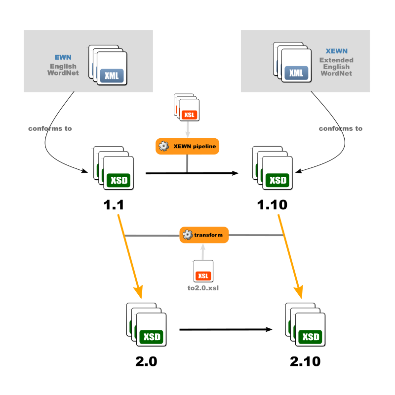

# Xtended English Wordnet Schemas

The different folders (1.0, 2.0, 1.10, ...) correspond to different validation levels that may apply to different sets of data.

Downloadable [here](https://x-englishwordnet.github.io/schemas/).

Design is modular so a full schema involves several files.

The main entry points (to be included as headers or referenced in validation) are:

- https://x-englishwordnet.github.io/schemas/1.1/EWN-LMF-1.1.xsd
- https://x-englishwordnet.github.io/schemas/1.1/EWN-LMF-1.1-relax_idrefs.xsd
- https://x-englishwordnet.github.io/schemas/1.10/xEWN-LMF-1.10.xsd
- https://x-englishwordnet.github.io/schemas/1.10/xEWN-LMF-1.10-relax_idrefs.xsd
- https://x-englishwordnet.github.io/schemas/2.0/EWN-LMF-2.0.xsd
- https://x-englishwordnet.github.io/schemas/2.0/EWN-LMF-2.0-relax_idrefs.xsd